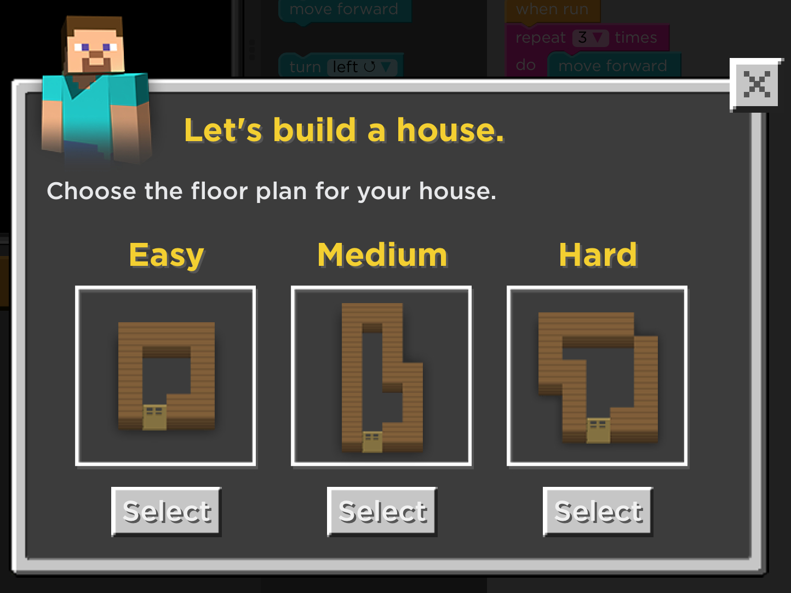
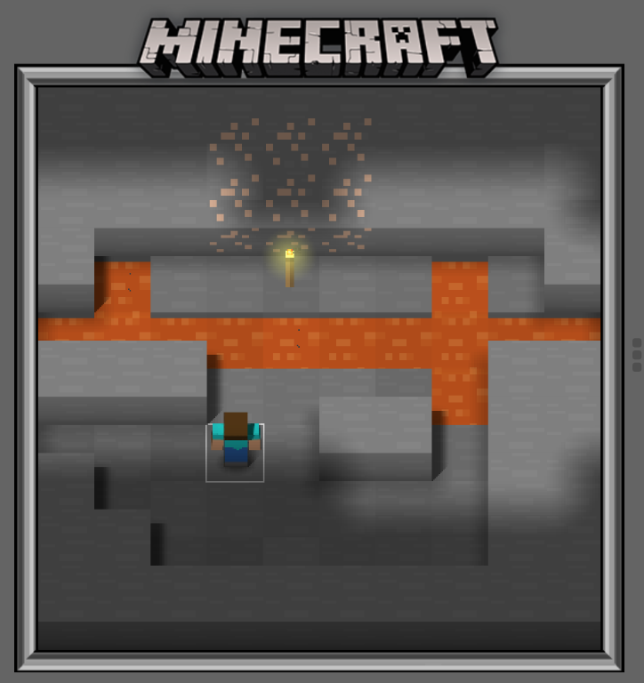
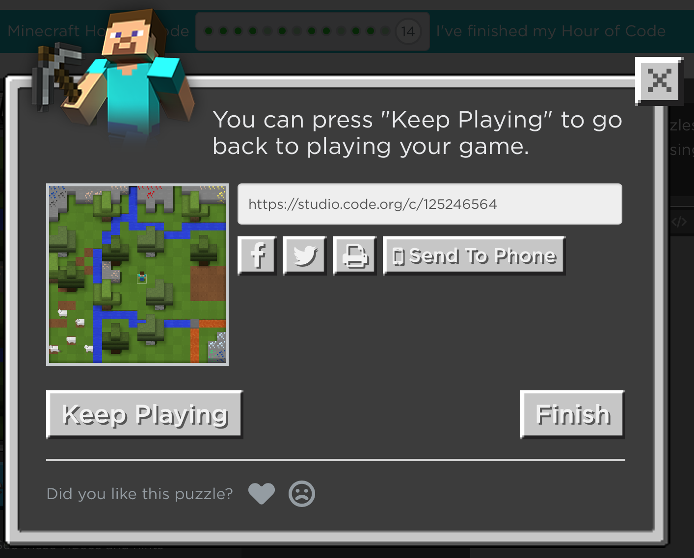
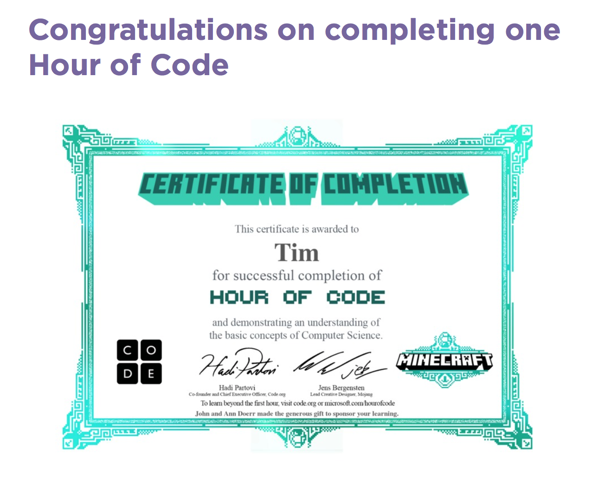
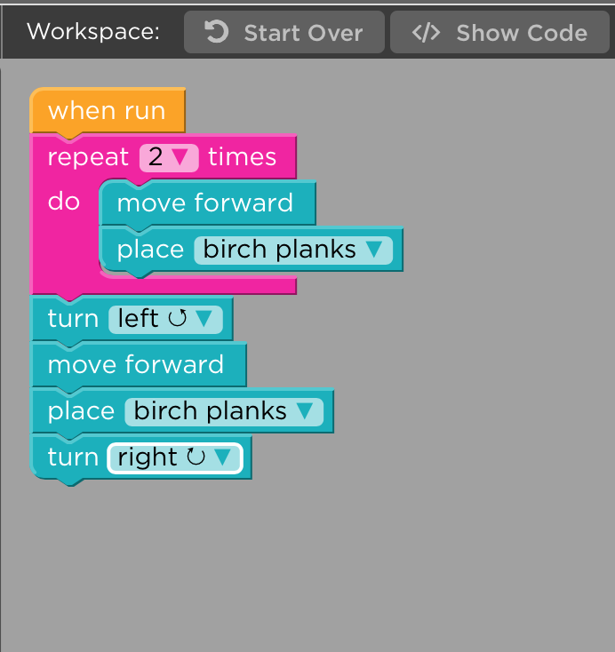

# [The Game - Hour of Code Minecraft](https://code.org/minecraft)  

## What does the player do
The player drag and drops code blocks into a canvas to stack up a sequence. The sequence will then be executed by either the male or female minecraft character. Nearly each level has a different goal. Goals are e.g:
- sheer the sheeps
- destroy the trees
- build a house
- plant crops

## Sequence
For each level you build a stack of code blocks, which are executed top to bottom once the run button is clicked. If the level's goal wasn't reached at the end of the code block stack, you can modify and start it again.

## Levels
The levels have kind of the same goals as in Minecraft, you just do the tasks programatically instead of manually. You plant and harvest crops, sheer sheep and destroy trees to gather resources to build a house. (Just like in the real Minecraft game)

# Game Progress
1. "move forward" in front of a sheep
1. "rotate into direction"
1. "destroy" block to cut down a tree
1. "sheer" to take wool from sheep
1. combine move rotate and destroy to cut down multiple trees
1. "repeat" is introduced
1. build your home
1. plant crops
1. walk around creeper
1. place torches
1. place block to get over lava
1. new concept "if statements"
1. lay rails to your home
1. congratulation video and free play

# What's Good / Bad

## Good
#### You can choose between male and female character
#### It's exaclty described what you have to do in the first levels
#### You can take a look at the code generated with the blocks
#### Explanation video for new concepts (e.g. loops)
#### Known graphics (Minecraft)
#### Different difficulties to choose from

#### Independant quests with same concepts (won't get boring too easily)

#### Congratulation video
#### Share what you did

#### Certificate

## Bad
#### If you don't reach the goal, nothing happens... You have to realise yourself that the goal wasn't reached
#### A lot of given code at the start of each level (too easy)

#### Can't duplicate blocks
#### Even if code is too long, level is won
#### Number of blocks is restricted, but will work even if there are more blocks

#### No speed of of the executed level

