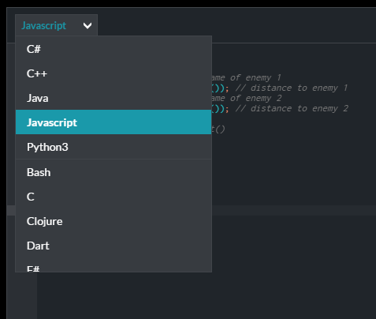
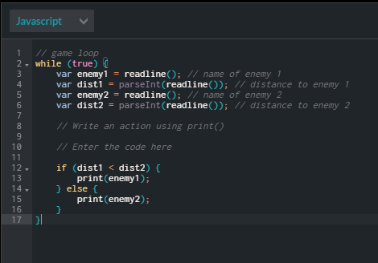
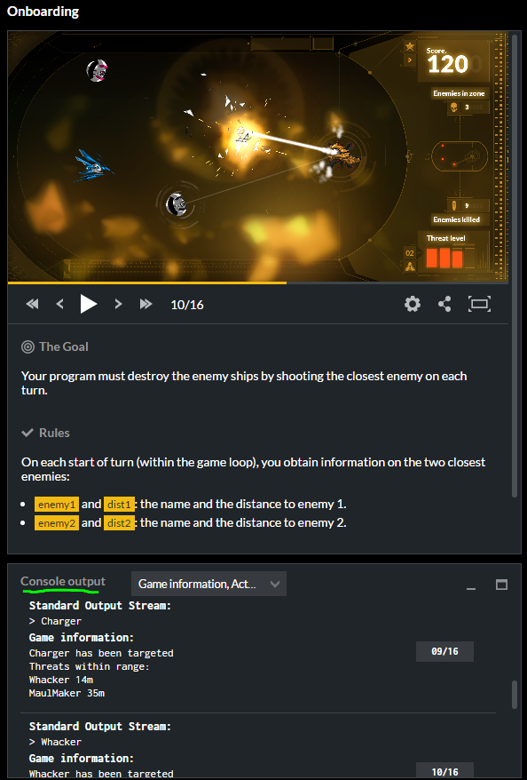
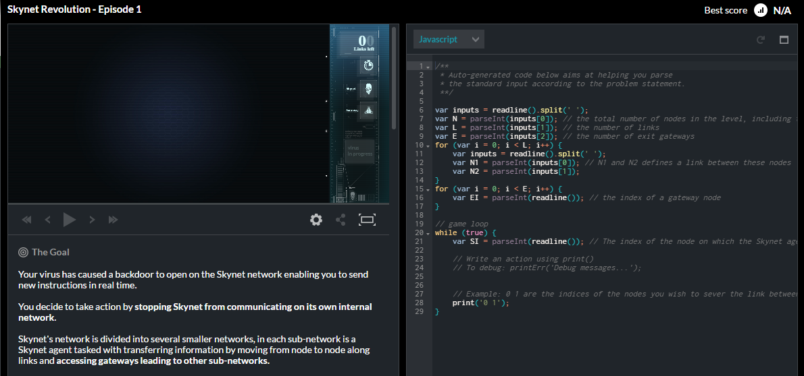

# [The Game](http://www.codingame.com)  
This is actually a platform.

## What does the player do
Player writes real Code in one of the many supported Languages to solve a Game Puzzle:  

Languages | Code
 --- | ---
 |   

The Code is placed inside a regular Game Loop and executed.  
Usually the Game puts out some State via the Console and expects a "print" for the next action to do.  
This can be seen at the right-hand screenshot:  

1. The Programm reads in the relevant data from the console. This code part is predefined and replaces the explanation of an API or something.  
1. The 'IF'-Part is user-created. It checks for the closes enemy and prints it out as input to the game  

The Game is started by pressing "Run Tests" - Every Level a couple of tests are present to check the code

The result looks like this:  
  

* The Video Output can be paused, rewinded, sped up etc.
* The Log at the bottom scrolls with the progress of the video
* The Video jumps to the location of the log as well

## Levels

Different Levels teach different "Skills" and take place in different Settings (Eg. Level 1 was a spaceship shooting at other spaceships, Level 2 was a spaceship landing and destroying the highest mountain each turn in order to land)  
Okay they seem to like Spaceships.  
The Description with the goals is placed below the Video Box. At the very bottom of this description we can also find a little bit of story.

# Game Progress

After the very first tutorial Level we are dropped off inside the platform dashboard and can chose more levels to play. They are classified by difficulty and tagged with some programming concepts/objects like ('Pathfinding', 'Graphs', 'AI') etc.

# What's Good / Bad

## Good

* Looks really really fancy
* Platform
  * Community
  * Achievments
  * Exp
  * Progress being saved
* Users can create Levels as far as I saw
* Multiplayer Mode solving Puzzles (fastest - regular, with least code, fastest - only given the "unit"-tests)
* Many many many Languages
* Runs smooth

## Bad

* Console as IO
  * Information read in via console and parsed
    * It should be possible to store the parsed data into meaningful object, but they decide to declare many variables with very short names instead.
  * Send information to the game via a console print
  * These two points are not CONs by default, but it feels wrong and terrible.
* Comments in the Text are put behind code statements in the same line. Really annoying to edit
* No Autocompletion in Editor
* Writing the Code in the given IDE gets really annoying very quickly
  * As a Coder with my own IDE + it's Settings I am really used to code in a given style and with given hotkey, this is (of course) not possible here

The following Screenshot may give you an Expression of the Editor Messiness with all the parsing, assigning to Vars etc.  
  

## In general
This platform wants to address advanced coders.  
As an advanced Coder, the levels with their taught content and the way I need to code and handle the task, is simply not fun. I'm sorry.  Taking a look at the Leaderboard though you can see many University Students who played this game to a decent extend. So it may be just me.  

## Conclusion
* Unrelevant for us now (16.01.2017)
* Worth a second look when trying to make a platform around the game
