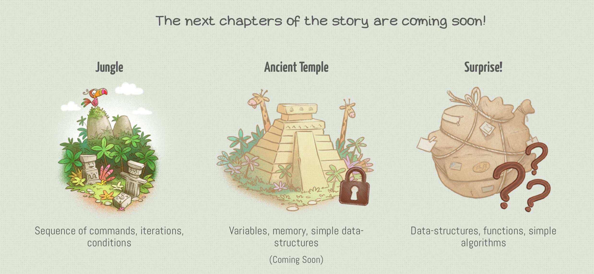

# [The Game](https://www.allcancode.com)  

## What does the player do
The player drag and drops code blocks into a canvas to stack up a sequence. The sequence will then be executed by either the male or female character. The goal is to reach the in gold highlighted tile.

## Sequence
For each level you build a stack of code blocks, which are executed top to bottom once the play button is clicked.
If the level's goal wasn't reached at the end of the code block stack, you can modify and start it again.

## Levels
In each level, the player has to move the character to the golden tile. There are no optional ways, only one way is
possible, so you know exactly what to do.

# Game Progress
1. Fill your notebook with the tutorial sheets
1. simple "step forward" on the goal
1. rotating is added
1. "jump forward" is added. Jumpong over plants and gaps. 
1. "repeat x times" is added. Simple loops up to 9 times to walk forward.
1. "repeat x times" for more complex movement "stair like"
1. nested loops
1. while loops are introduced
>Stopped at level 22 due to slow progress and few changes per level

# What's Good / Bad

## Good
#### 27 supported languages
#### Cute Design -> childish graphics
#### You can choose between a boy and a girl
#### Introduction sequence for each terrain
#### When new blocks are added, you drag them like "skills" into you notebook
#### Made for very small children
#### Special game mode where you have to activate all tiles (step on each once)
#### On mobile, kindle and chrome webstore
#### Code blocks are saved on game exit
#### More to come (variables, data structures)

## Bad
#### Left and right rotation is added seperately
#### Extremely slow progress
#### Always 3/3 Stars (until level 14)
#### Because of the slow progress, the code stacks get pretty tall
#### No hint on how to get more stars (probably less code blocks)

