## Tutorial 1
> Introduction to basic movement -> move[Forward/Backward....]  
> Moving on predefined path check "Highlight way to goal"

#### Small game field -> e.g. 5 * 5

1. Understanding move (rotate and move separately)
  - Move Forward
  - Rotate Left
  - Rotate Right
  
2. "Real" move (moving automatically handles rotation)
  - Move Forward
  - Move Right 
  - Move Left
  - Move Backward
  
## Tutorial 2
> Introduction to loops -> x times / forever / while

1. Same task as in *Tutorial 1* only with loops
  - Move within repeat loop
  
2. 

## What do others have ? 
> code.org / codecombat.com 

### Level Goals  
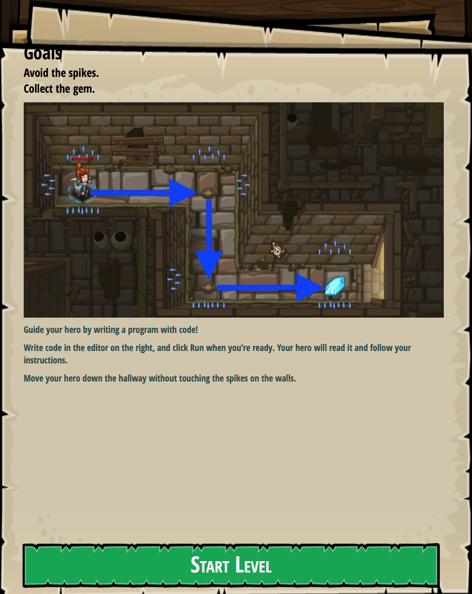

### Level Quests  
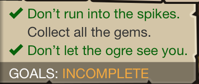

### A bit of Story
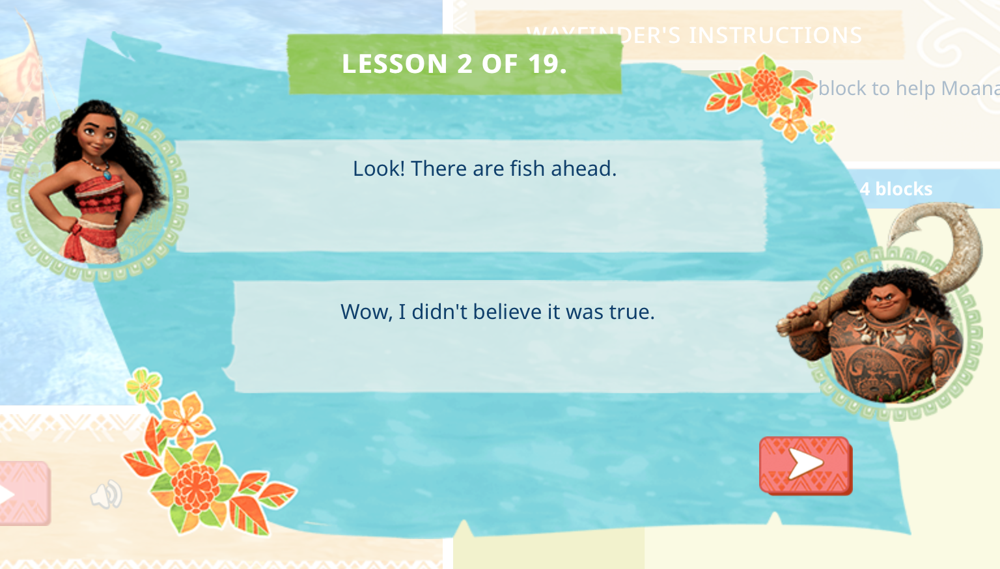

### Fix your Code info
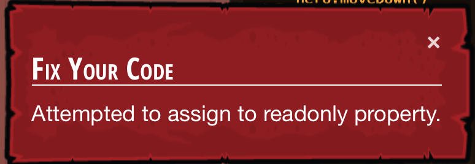

### Unused Code is highlighted
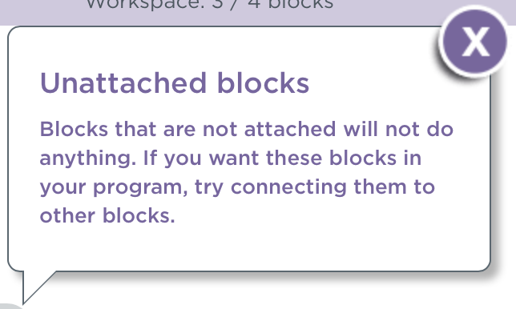

### Help video
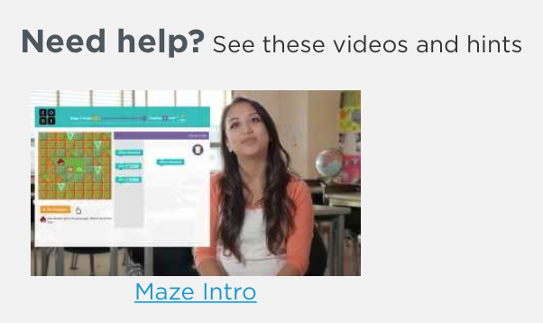

### Highlight way to "goal"
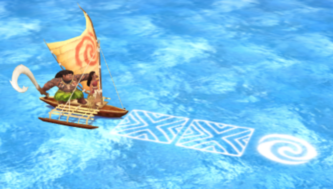

### Method desription
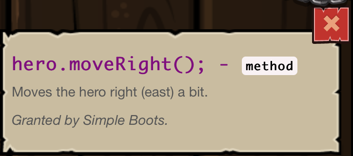

### Start over current run

### Start over and show Code

### Show Code
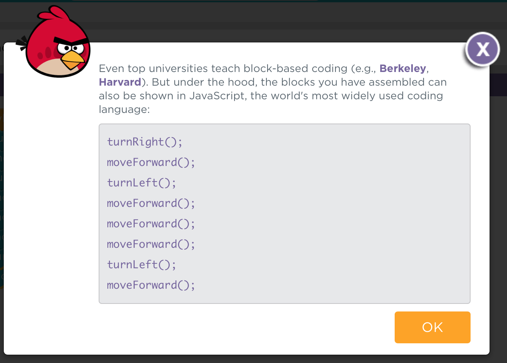

### Winning Stats
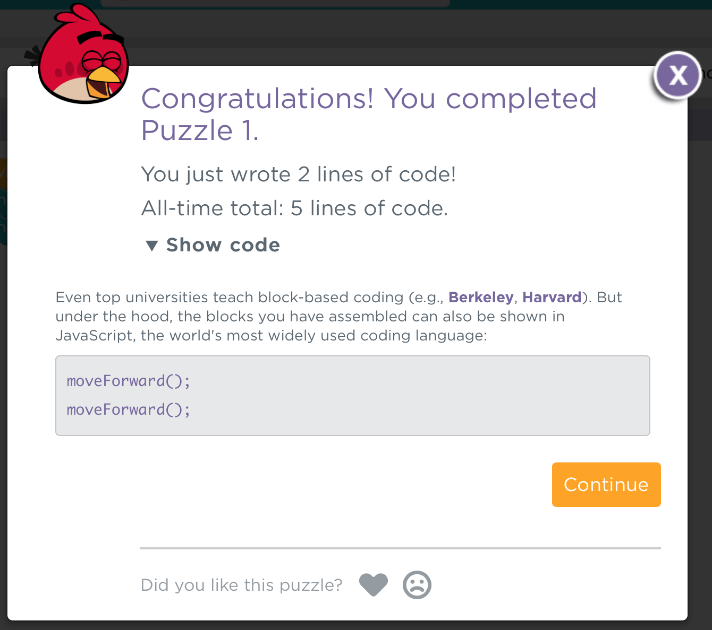

### "Items" on Victory
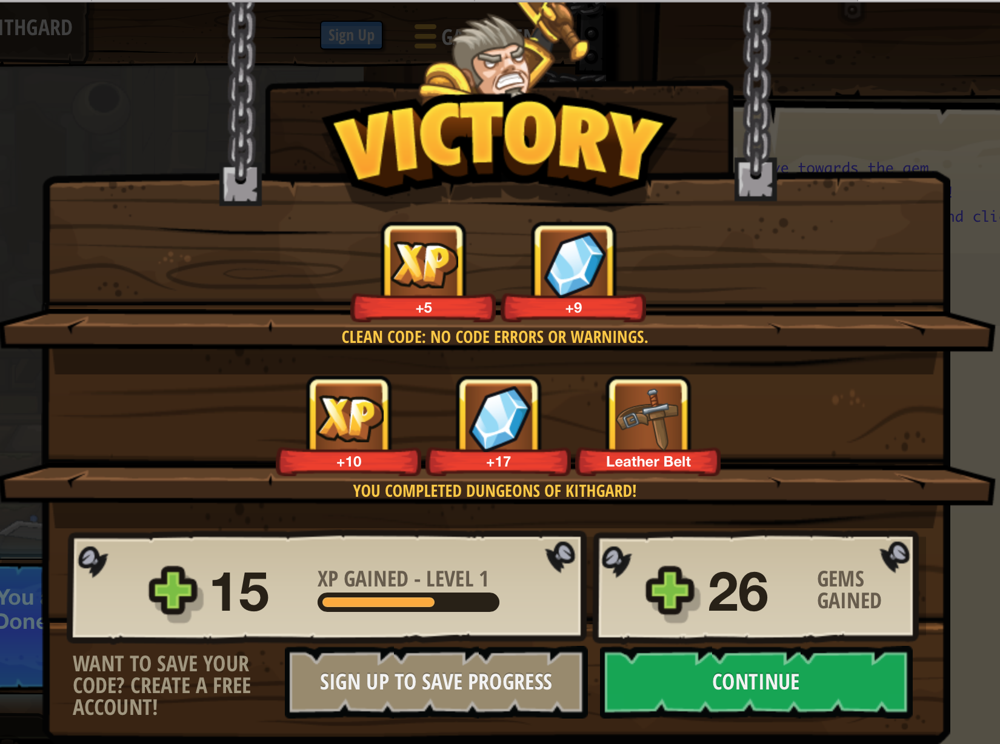

### Level up
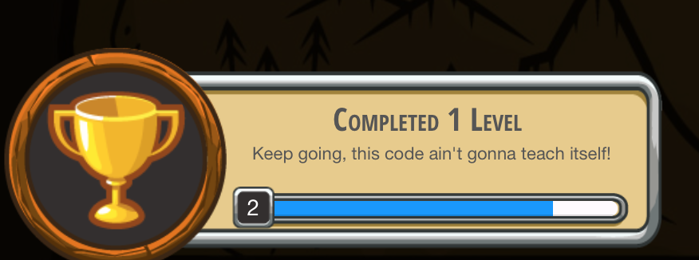
